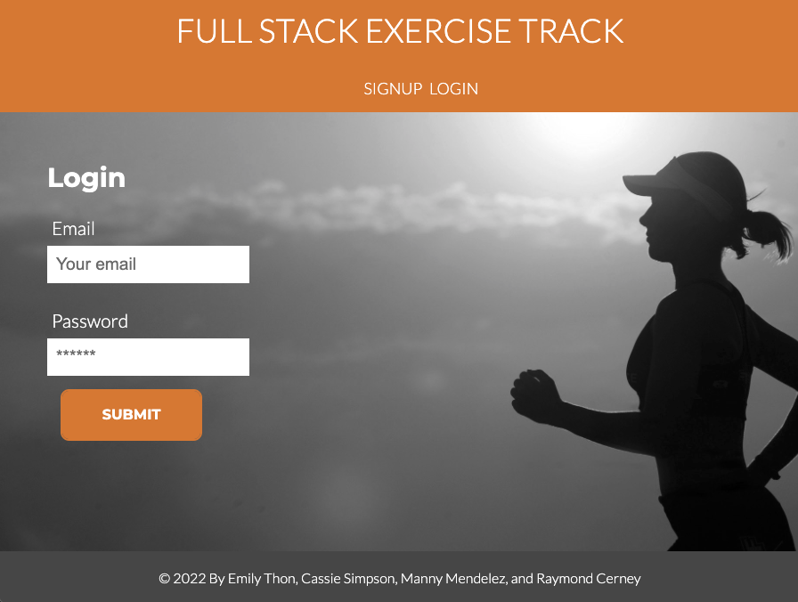

# Full Stack Exercise Track

  ## Description
  Full Stack Exercise Track demonstrates the MERN stack, using MongoDB & Mongoose (along with GraphQL/Apollo) for our database, Express & Node for our API, and React as our front-end library. This application allows logged in users to track, edit, and delete exercises. 

  
  ## Table of Contents
  * [Installation](#installation)
  * [Usage](#usage)
  * [License](#license)
  * [Contributing](#contributing)

  ## Installation
  The user should clone the repository from GitHub and install dependencies. For development or testing purposes, run `npm install` on both client and server directories to install dependencies. There are two servers for client side and server side, which can be run on their own. To run both servers at the same time, open the root directory and run `npm run develop`.

  Alternatively, use the deployed version at: https://guarded-anchorage-60502.herokuapp.com/login

  ## Usage
  Log in or sign up to track your exercise.

  

  ## License
    
  Full Stack Exercise Track uses the [MIT](https://opensource.org/licenses/MIT) license.

  ## Contributing
  Full Stack Exercise Track was created by Manny Mendelez, Raymond Cerney, Emily Thon, and Cassie Simpson

  This project follows the Contributor Covenant.  
  

